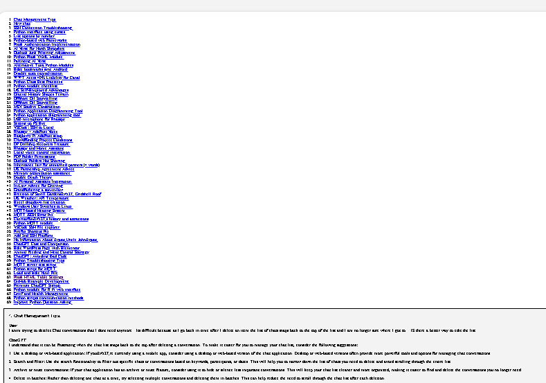

# Adding an Index to your Chat GPT History HTML File

How to make you chat history download look like this with an index at the start:



I had accumulated over 60 Chats and I was having problems finding my way to a useful item.   So I downloaded my chat history.

Trouble then was that I ended up with this big file and 69 chats and it was hard to find what I wanted.

So I worked with GPT4 to find a way to add an index.  (This is a little tricky for Chat GPT as it does not seem to know anything about its own system) 

Here is the result so you can make the same change.

You will end up with an HTML file in this format which when opened shows your chats without an index.

```
<html>
<head>
    <title>ChatGPT Data Export</title>
    <style>
        body {
            margin: 20px;
        }
        h4 {
            font-family: sans-serif;
            margin: 0;
        }
        #root {
            display: flex;
            flex-direction: column;
            gap: 20px;
        }
        .conversation {
            border: 1px solid black;
            padding: 20px;
            background-color: #f3f3f3;
        }
        .message {
            white-space: pre-wrap;
            margin: 20px 0;
        }
        .author {
            font-weight: bold;
            margin-bottom: 4px;
        }
        .author::first-letter {
            text-transform: uppercase;
        }
    </style>
    <script>
var jsonData = [{"title":
<< Then all your history with each item starting with "{title">>
]
<script>

<< Here you will find scripts which display your chats without and index>>

</script>
</head>
<body>
<div id="root">
</div>
</body>
</html>
```
What GPT4 gave me was a replacement set of scripts to put at the end that caused an index to appear at the start of the file like this where the "]" is at the end of the json data.

```
]
function createTableOfContents(jsonData) {
        const toc = document.createElement('ol');
        
        jsonData.forEach((chatData, index) => {
            const listItem = document.createElement('li');
            const link = document.createElement('a');
            link.setAttribute('href', `#chat-${index}`);
            link.textContent = chatData.title;
            listItem.appendChild(link);
            toc.appendChild(listItem);
        });

        document.body.prepend(toc);
    }

    function renderConversations() {
        const rootElement = document.getElementById('root');
        const conversations = jsonData.map((data, index) => {
            const conversationElement = document.createElement('div');
            conversationElement.id = `chat-${index}`;
            conversationElement.classList.add('conversation');
            
            const titleElement = document.createElement('h4');
            titleElement.textContent = `${index + 1}. ${data.title}`;
            conversationElement.appendChild(titleElement);
            
            const messages = getConversationMessages(data);
            for (const message of messages) {
                const messageElement = document.createElement('div');
                messageElement.classList.add('message');
                
                const authorElement = document.createElement('div');
                authorElement.classList.add('author');
                authorElement.textContent = message.author;
                messageElement.appendChild(authorElement);
                
                const contentElement = document.createElement('div');
                contentElement.textContent = message.text;
                messageElement.appendChild(contentElement);
                
                conversationElement.appendChild(messageElement);
            }
            
            return conversationElement;
        });
        
        rootElement.append(...conversations);
    }
    
    function getConversationMessages(conversation) {
        var messages = [];
        var currentNode = conversation.current_node;
        while (currentNode != null) {
            var node = conversation.mapping[currentNode];
            if (node.message &&
                node.message.content &&
                node.message.content.content_type == "text"
                && node.message.content.parts.length > 0 &&
                node.message.content.parts[0].length > 0 && 
                node.message.author.role != "system") {
                author = node.message.author.role;
                if (author === "assistant") {
                    author = "ChatGPT";
                }
                messages.push({ author, text: node.message.content.parts[0] });
            }
            currentNode = node.parent;
        }
        return messages.reverse();
    }

    document.addEventListener('DOMContentLoaded', () => {
        createTableOfContents(jsonData);
        renderConversations();
    });
</script>
</head>
<body>
<div id="root">
</div>
</body>
</html>

```

Then when you open the file you will get a nice index at the start of the file which are links to the individual chats.
